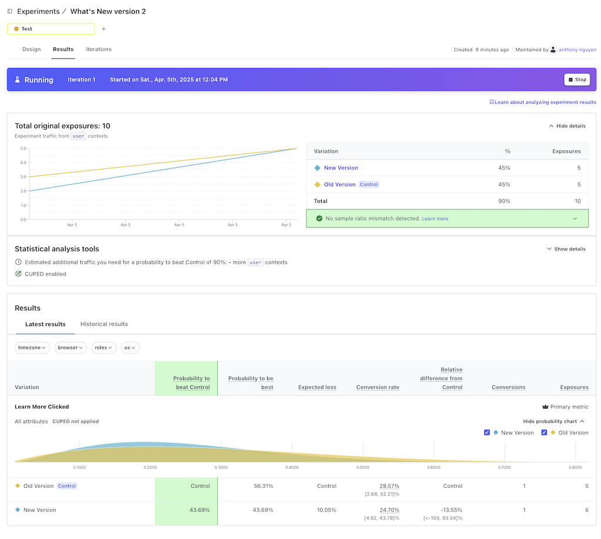

# LaunchDarkly Demo using a simple 3 tier web app (.NET 8, React)

This repo was forked from https://github.com/NetCoreTemplates/react-spa to demonstrate some key features of LaunchDarkly:
- Feature Flags: Add a flag to turn a new feature on or off. You can release the feature by turning the flag on, and roll it back by turning it off.
- Instant Updates: Set up a listener so changes to the flag take effect right away—no page refresh needed.
- Remediate: Use a trigger (like a curl command or a browser action) to quickly turn off a feature if something goes wrong.

# Prerequisites
- [.NET 8 SDK installed](https://dotnet.microsoft.com/en-us/download/dotnet/8.0)
- Node version 20+
- Sign up for a free LaunchDarkly account at [https://app.launchdarkly.com/signup](https://app.launchdarkly.com/signup)

# Run project locally
```bash
# install npm dependencies
cd ../MyApp.Client
npm install

# run the UI
cd MyApp
dotnet restore

# run migration and seed data
dotnet run --AppTasks=migrate

# run the app
dotnet run

# open https://localhost:5173 to see the current version of the web app as is
```

# Release and Remediate

## Feature Flag

Let's assume that the `Counter` is a brand new feature that we would like to safely release to production by toggling the feature on and rolling it back by toggling it off.

### Steps

First, you need to get your Test Environment Client Side ID by going to https://app.launchdarkly.com/projects/default/settings/environments and click on 3 dots menu and select `Client-side ID` to copy it

Go to https://app.launchdarkly.com/projects/default/flags and create a new Flag:
- name: `Feature: Counter`
- Description: `This flag control the visibility of the Counter feature on the home screen`
- Enable `SDKs using Client-side ID`
- Category: `Release`
- Type: `Boolean`
- Variations: `Available` and `Unavaiable`
- Default variations: `Unavailable` for both Target ON and OFF


```bash
# install LaunchDarkly SDK from inside \MyApp.Client folder
npm install launchdarkly-react-client-sdk
```

Modify main.tsx
```jsx
// add 
import { asyncWithLDProvider } from 'launchdarkly-react-client-sdk';

// ... existing code

// Wrap your App with LDProvider
const app = createRoot(document.getElementById('root')!);

(async () => {
	const LDProvider = await asyncWithLDProvider({
		clientSideID: 'YOUR_ENV_CLIENT_ID', // enter your LaunchDarkly environment client ID here
	});
app.render(
    <StrictMode>
        <Router>
            <ScrollToTop />
				<LDProvider>
					<App />
				</LDProvider>
        </Router>
		</StrictMode>
	);
})();
```

Modify the Header.tsx
```jsx
import { withLDConsumer } from 'launchdarkly-react-client-sdk';

// update 
export default withLDConsumer()(({flags}) => {
    // existing code
    {flags.featureCounter === true ? (
        <li className='relative flex flex-wrap just-fu-start m-0'>
            <NavLink to='/counter' className={navClass}>
                Counter
            </NavLink>
        </li>
    ) : null}
    // existing code
})

```

Go to the `Feature Counter` flag on LaunchDarkly and Toggle it on and serve `Available` to all traffic. 

You will notice how the `Counter` top nav is now visible in **realtime**. If you serve `Unavailable` then the menu item will disappear.

## Feature Flag - Server Side

Currently the `https://localhost:5173/weather` is showing the Summary randomly. So -13C could be displayed as `Scorching` while 30 could be `Freezing`. Let's improve this.

Going to https://app.launchdarkly.com/projects/default/settings/environments and click on 3 dots menu and select `SDK Key` to copy it

Go to https://app.launchdarkly.com/projects/default/flags and create a new Flag:
- name: `Get Weather V2`
- Description: `return appropriate temperature description based on real temperature`
- Category: `Release`
- Type: `Boolean`
- Variations: `Available` and `Unavaiable`
- Default variations: `Unavailable` for both Target ON and OFF

Install the required dependencies

```bash
cd MyApp
dotnet add package LaunchDarkly.ServerSdk
cd ../MyApp.ServiceInterface/
dotnet add package LaunchDarkly.ServerSdk
```

Add new setting to `appsettings.Development.json`
```json
{
    "LaunchDarklySdkKey": "YOUR_SDK_ABOVE",
    "Logging": { ... }
}
```

Update Program.cs

```csharp
using LaunchDarkly.Sdk.Server;

//.. existing code
services.AddServiceStack(typeof(MyServices).Assembly);

// register singleton for the LdClient
var config = Configuration.Builder(builder.Configuration.GetValue<string>("LaunchDarklySdkKey"))
  .StartWaitTime(TimeSpan.FromSeconds(5))
  .Build();
var client = new LdClient(config);
services.AddSingleton(client);

```

Modify MyService.cs 

```csharp
using LaunchDarkly.Sdk;
using LaunchDarkly.Sdk.Server;

public class MyServices : Service
{
    private readonly LdClient ldClient;
    public MyServices(LdClient ldClient)
    {
        this.ldClient = ldClient;
    }

    // ... existing code
    private string GetSummaryForTemperature(int temperatureC)
    {
        return temperatureC switch
        {
            <= -10 => "Freezing 🥶",
            <= 0 => "Bracing 🌬️",
            <= 10 => "Chilly ❄️",
            <= 15 => "Cool 🍃",
            <= 20 => "Mild 🌤️",
            <= 25 => "Warm 🌞",
            <= 30 => "Balmy 🌴",
            <= 35 => "Hot 🔥",
            <= 40 => "Sweltering 🌡️",
            _ => "Scorching 🌋",
        };
    }

    public async Task<object> Any(GetWeatherForecast request)
    {
        var userSession = await GetSessionAsync();
        var roles = userSession?.Roles != null ? string.Join(",", userSession.Roles) : "guest";
        var context = !string.IsNullOrEmpty(userSession?.Email)
            ? Context.Builder(userSession.Email)
                .Name(userSession.DisplayName)
                .Set("roles", roles)
                .Build()
            : Context.Builder("ananymous")
                .Anonymous(true)
                .Build();

        var useV2Summary = ldClient.BoolVariation("get-weather-v-2", context, false);

        var rng = new Random();
        return await Task.WhenAll(Enumerable.Range(1, 5).Select(async index =>
        {
            var temperatureC = rng.Next(-20, 55);

            return new Forecast(
            Date: (request.Date ?? DateOnly.FromDateTime(DateTime.Now)).AddDays(index),
                TemperatureC: temperatureC,
                Summary: useV2Summary ? GetSummaryForTemperature(temperatureC) : summaries[new Random().Next(summaries.Length)]
                );
        }));
    }
    // ... existing code
}
```

Go to the `get-weather-v-2` flag on LaunchDarkly and Toggle it on and serve `Available` to all traffic. Refresh the Weather page you now show see correct summary value being returned based on the temperature

## Feature Flag - Subscribe to Flag change event and triggers

Instead of using `withLDConsumer` above, you can manually subscribe to flag change event.

Let's add a new `Kill switch` type flag which will turn off the `To Do` app and immediately redirect user to home

Go to https://app.launchdarkly.com/projects/default/flags and create a new Flag:
- name: `Feature: Todos`
- Description: `This Flag control the to do app`
- Category: `Kill switch`
- Type: `Boolean`
- Variations: `Enabled` and `Disabled`
- Default variations: `Enabled` for Target ON and `Disabled` for Target OFF

Edit Header.tsx, wrap `/todomvc` NavLink as follow

```jsx
// existing code
{
flags.featureTodos === true
? <li className="relative flex flex-wrap just-fu-start m-0">
    <NavLink to="/todomvc" className={navClass}>Todos</NavLink>
  </li>
: null
}
```

Edit `todomvc.tsx` to force user back to Home if this feature is turned off on LaunchDarkly

```jsx
import { useLDClient } from 'launchdarkly-react-client-sdk';
import { useNavigate } from "react-router-dom"

// .. existing code

const TodosMvc = () => {
    const navigate = useNavigate()
    const ldClient = useLDClient();
    ldClient.on('change:feature-todos', (isEnabled) => {
        if (!isEnabled) {
            navigate('/');
        }
    });
    // ... existing code
}
```

Navigate to https://localhost:5173/todomvc, then on another tab, go to the `feature-todos` flag on LaunchDarkly and turn the flag off, you should see that the Menu item is removed and user is forcefully redirected to home

# Target your Feature Flag based on Context and rule

Let's assume you want to turn on the Feature flag for the new `smart weather` app only if the logged in user has `Admin` role (Assuming Admin = developers)

To do this, we will use the additional context information about the logged in user to decide whether we serve the feature flag to them or not

To do this
- Access the web app at https://localhost:5173/signin and login using the `admin@email.com`, `manager@email.com` and `employee@email.com` (password is `p@55wOrd`)
- Go to the `get-weather-v-2` flag on LaunchDarkly and click on `Add rule` button and select `Build a custom rule`
- Select
    - Context kind: user
    - Attribute: roles
    - Operator: is one of
    - Values: `Employee,Admin,Manager`
    - Serve: Available
- Set default Rule to serve Unavailable 
- Now try access the web app again using different users, you will see that only Admin user now can see the v2 of the Get Weather API 

## Target specific user
- Alternatively, you can also target individual user 
- Go to the `get-weather-v-2` flag on LaunchDarkly and click on `Add rule` button and select `Target individuals`
- User server `Avaiable`, select `employee@email.com`
- Now login into the web app as `employee@email.com` and you will see that both Admin and Employee can see the new Weather V2 api

# Measure the impact of the new feature using Metric and Experiment
Let's assume that you want to release a slightly improved version of the `https://localhost:5173/whatsnew` page with the goal of getting more user to click on the Learn More button. You want to compare the performance between the 2 versions to see which version will result in a better click rate

## Steps

Go to https://app.launchdarkly.com/projects/default/flags and create a new Flag:
- name: `What's new v2`
- Description: `What's new page version 2 with with Bigger and more colourful Learn more button`
- Category: `Experiment`
- Type: `Boolean`
- Variations: `New Version` (true) and `Old Version` (false)
- Default variations: `Old Version` for both Target ON and OFF

Update Header.tsx to identify context for when user is logged in or not

```jsx
// ... existing code
import { useEffect } from "react";

export default withLDConsumer()(({flags, ldClient}) => {
    const { auth, signout } = useAuth()

    useEffect(() => {
        const currentContext = ldClient?.getContext();

        const userAgentInfo = {
            userAgent: navigator.userAgent,
            os: navigator.platform,
            browser: navigator.appName,
            version: navigator.appVersion,
            language: navigator.language,
            timezone: Intl.DateTimeFormat().resolvedOptions().timeZone,
            screenWidth: window.screen.width,
            screenHeight: window.screen.height
        };

        if (auth && currentContext?.anonymous) {
            ldClient.identify({
                key: auth.userName,
                name: auth?.userName,
                email: auth.userName,
                custom: {
                    roles: auth.roles?.join(','),
                    ...userAgentInfo
                },
            });
        } else {
            if (!auth && ldClient) {
                ldClient.identify({
                    key: 'anonymous',
                    anonymous: true,
                    custom: {
                        roles: 'guest',
                        ...userAgentInfo
                    },
                });
            }
        }
    }, [auth]);
    // ... existing code
}
```

Modify whatsnew.tsx

```jsx
// ... existing code
import { withLDConsumer } from 'launchdarkly-react-client-sdk';

export default withLDConsumer()(({flags}) => {
    // ... existing code
    <a href={feature.url}></a>
    {
        flags.whatsNewV2 === true
        ? <div className="text-center my-10 learnMore">
                <a href={feature.url} className="text-white text-lg font-bold py-4 px-6 rounded-lg outline-none focus:outline-none mr-2 mb-2 bg-gradient-to-r from-blue-500 to-purple-600 active:from-blue-600 active:to-purple-700 shadow-lg hover:shadow-xl ease-linear transition-all duration-150">
                    Learn more
                </a>
            </div>
        : null
    }

    <div className="prose dark:prose-invert max-w-none">
        <MarkdownComponent type="whatsNew" doc={feature} group={release} />
    </div>
    {
        !flags.whatsNewV2
        ? <div className="text-center sm:text-left my-10 learnMore">
                <a href={feature.url} className="text-white text-sm font-semibold py-2.5 px-3.5 rounded outline-none focus:outline-none mr-1 mb-1 bg-slate-700 active:bg-slate-600 shadow hover:shadow-lg ease-linear transition-all duration-150">
                    Learn more
                </a>
            </div>
        : null
    }
    // ... existing code
})
```

Create new Metric in LaunchDarkly
- Kind: Clicked or tapped
- Click targets: `.learnMore`
- Target Type: Substring match
- Target URL: `/whatsnew`
- Measure: Occurence
- Select `user` as units
- Name: Learn More Clicked
- Description: Number of times Learn More button was clicked

Browse the app so that we have enough data in LaunchDarkly. You then can go to `Monitor > Contexts` to see the list of users with different attributes like Brower, Timezone etc.

Create new Experiment
- Name: What's New version 2
- Hypothesis: If I make the Learn More button stand out (bigger and more colourful), it will result in more user click
- Type: Feature change
- Randomization Unit: Unit
- Attributes: select a few, e.g. timezone, browser, roles, os
- Metrics: `Learn More Clicked`
- Flag: `What's new v2`
- Audience: 
    - Default rule
    - Audience amount: 90%, 10% not in this experiment will be served `Old Version`
    - Split experiment audience equally
    - select `Control` on the `Old Version` 
- Approach: Bayesian
- Threshold: 90%
- Start the experiment

Open https://localhost:5173/whatsnew on multiple browsers (e.g Chrome, Safari) or on different private windows, login as different users in order to simulate different user

After sometime, go to `What's New version 2` experiement, you should see something like this




